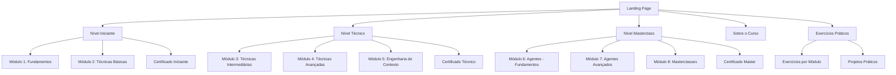
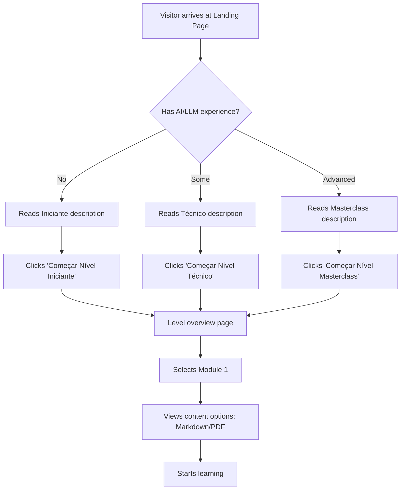
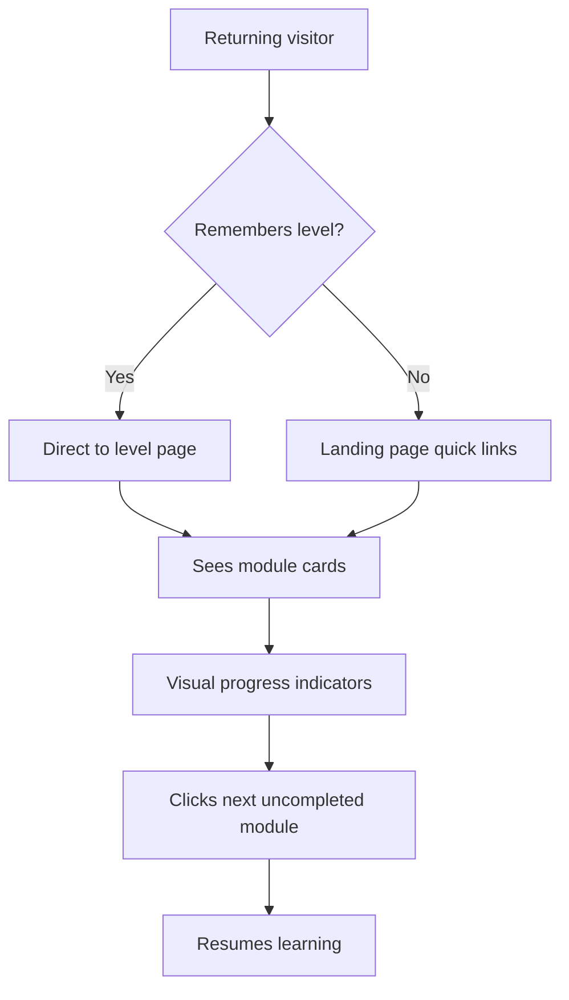
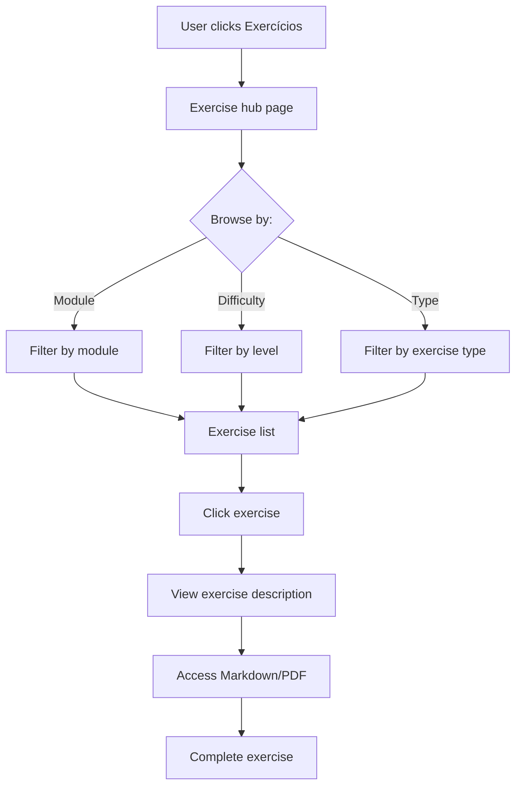

# FEP - Plataforma de Curso UI/UX Specification

**Document Version:** 1.0
**Last Updated:** 2025-10-23
**Author:** Sally (UX Expert)

---

## Introduction

This document defines the user experience goals, information architecture, user flows, and visual design specifications for the **FEP - Engenharia de Prompt** course platform user interface. It serves as the foundation for visual design and frontend development, ensuring a cohesive and user-centered experience.

### Overall UX Goals & Principles

#### Target User Personas

**1. Estudante Iniciante**
- No prior experience with AI/LLMs
- Seeks guided learning from zero
- Prefers didactic and progressive explanations
- Time: 12-15 hours available for beginner level

**2. Profissional Técnico**
- Already works with technology
- Wants to apply Prompt Engineering at work
- Seeks practical examples and quick ROI
- Time: 35-45 hours for technical mastery

**3. Expert/Pesquisador**
- Advanced knowledge in AI
- Wants to master agents and complex systems
- Seeks cutting-edge content and innovation
- Time: 50-60 hours for complete mastery

#### Usability Goals

- **Navigation Clarity:** User finds the right level in less than 10 seconds
- **Clear Progression:** Visualize learning path and progress
- **Quick Access:** Go directly to content (Markdown/PDF) with 1 click
- **Mobile-Friendly:** Works perfectly on smartphones
- **Zero Friction:** No login, no barriers, 100% free and open

#### Design Principles

1. **Elegant Minimalism** - Clean design, no distractions
2. **Clear Visual Hierarchy** - The 3 levels well differentiated
3. **Immediate Action** - Each card leads directly to learning
4. **Inspiring Progression** - Show the journey visually
5. **Accessible to All** - WCAG 2.1 AA compliance

#### Change Log

| Date | Version | Description | Author |
|------|---------|-------------|--------|
| 2025-10-23 | 1.0 | Initial specification | Sally (UX Expert) |

---

## Information Architecture (IA)

### Site Map / Screen Inventory

### Navigation Structure

**Primary Navigation:**
- Simple top navigation bar with logo and 4 main sections:
  - "Início" (Home/Landing)
  - "Cursos" (dropdown: Iniciante | Técnico | Masterclass)
  - "Exercícios"
  - "GitHub" (link to repository)

**Secondary Navigation:**
- Within each level page: Module cards with direct links to content
- Breadcrumbs for context when viewing specific modules

**Breadcrumb Strategy:**
- Format: Home > [Level Name] > [Module Name]
- Always visible on module detail pages
- Clickable path for easy navigation back

---

## User Flows

### Flow 1: First-Time Visitor Discovery

**User Goal:** Understand course structure and choose starting level

**Entry Points:**
- GitHub repository README link
- Direct URL share
- Search engine results

**Success Criteria:** User selects appropriate level and starts learning

#### Flow Diagram

#### Edge Cases & Error Handling:
- User unsure of level → "Não sabe por onde começar?" help section
- User wants to skip ahead → Warning about prerequisites but allow access
- Broken content links → Graceful 404 with navigation back

**Notes:** Keep the decision-making process simple with clear level descriptions and time commitments visible upfront.

---

### Flow 2: Returning Learner Progress

**User Goal:** Continue learning from where they left off

**Entry Points:**
- Bookmark
- GitHub repository
- Direct module link

**Success Criteria:** Quick access to next module without confusion

#### Flow Diagram

#### Edge Cases & Error Handling:
- No progress tracking (static site) → Visual chapter numbering helps
- Multiple modules in progress → Allow free navigation
- Completed all modules → Show certificate info and next level

**Notes:** Since this is a static site, we rely on visual clarity rather than technical progress tracking.

---

### Flow 3: Exercise Access

**User Goal:** Practice concepts with exercises

**Entry Points:**
- "Exercícios" navigation link
- In-module exercise links
- Direct GitHub file access

**Success Criteria:** Find relevant exercises and understand how to use them

#### Flow Diagram

#### Edge Cases & Error Handling:
- No exercises for specific module → Clear messaging
- User confused about format → Instructions at top of exercise page
- Solutions needed → Toggle/expandable solutions section

---

## Wireframes & Mockups

**Primary Design Files:** To be created in Figma/v0.dev

### Key Screen Layouts

#### Landing Page (Hero)

**Purpose:** Inspire and guide users to the right learning path

**Key Elements:**
- **Hero Section:**
  - Bold headline: "Domine a Engenharia de Prompt: Do Zero ao Especialista"
  - Subheadline: "97-120 horas de conteúdo estruturado em 3 níveis progressivos"
  - Visual: journey_path.png or custom illustration
  - Primary CTA: "Começar Agora" (scroll to levels)

- **Three-Level Cards:**
  - Side-by-side cards for Iniciante, Técnico, Masterclass
  - Each card shows: Icon, Name, Duration, Module count, Key topics (3-4), CTA button
  - Visual differentiation: Different accent colors per level

- **Course Stats:**
  - "8 Módulos Completos"
  - "Exercícios Práticos"
  - "Certificados de Conclusão"
  - "100% Gratuito e Open Source"

- **Footer:**
  - GitHub link
  - Author credit
  - License info (MIT/Creative Commons)

**Interaction Notes:**
- Smooth scroll to level cards on CTA click
- Hover effects on cards (subtle elevation)
- Responsive grid: 3 columns desktop, 1 column mobile

**Design File Reference:** `figma.com/[project-link]` or generated via v0.dev

---

#### Level Overview Page

**Purpose:** Show all modules within a level and guide sequential learning

**Key Elements:**
- **Level Header:**
  - Level badge/icon with color
  - Level name and total duration
  - Brief description (2-3 sentences)
  - Prerequisites if applicable

- **Module Grid:**
  - Card for each module
  - Module number, title, estimated time
  - Brief description (1 sentence)
  - Topics covered (bullet list, 3-5 items)
  - Access buttons: "Ver Markdown" | "Baixar PDF"

- **Progress Visualization:**
  - Simple progress bar showing X/Y modules (visual only, no tracking)
  - Or numbered badges showing sequence

- **Next Level Teaser:**
  - At bottom: Card previewing next level
  - "Pronto para o próximo desafio?" CTA

**Interaction Notes:**
- Cards laid out in grid (2-3 columns)
- Clear visual flow from Module 1 → Module N
- Direct links to GitHub raw markdown or PDF files

**Design File Reference:** `figma.com/[level-page]`

---

#### Exercise Hub

**Purpose:** Central location for all practical exercises

**Key Elements:**
- **Filter Tabs:**
  - "Todos" | "Por Módulo" | "Por Tipo"

- **Exercise Cards:**
  - Exercise title
  - Associated module(s)
  - Difficulty indicator (visual)
  - Estimated time
  - Brief description
  - "Acessar Exercício" button

- **Instructions Section:**
  - How to use exercises
  - How to check solutions
  - Tips for maximum learning

**Interaction Notes:**
- Filterable/sortable exercise list
- Clear visual grouping
- Mobile-optimized card layout

---

## Component Library / Design System

**Design System Approach:** Custom lightweight system optimized for GitHub Pages static hosting. Inspired by modern educational platforms (Coursera, Khan Academy) but simplified.

### Core Components

#### 1. Course Level Card

**Purpose:** Primary navigation element to each learning level

**Variants:**
- Iniciante (Beginner) - Green/teal accent
- Técnico (Technical) - Blue/indigo accent
- Masterclass - Purple/violet accent

**States:**
- Default
- Hover (slight elevation, accent border glow)
- Active/Selected

**Usage Guidelines:**
- Always show icon, level name, duration, brief description
- Use consistent card size across all three levels
- Include clear CTA button
- Show module count and key topics

---

#### 2. Module Card

**Purpose:** Represent individual modules within a level

**Variants:**
- Standard (not started)
- In Progress (visual indicator)
- Completed (checkmark badge)

**States:**
- Default
- Hover
- Clicked/Active

**Usage Guidelines:**
- Sequential numbering visible (Módulo 1, Módulo 2, etc.)
- Content access buttons always present
- Consistent sizing within level page
- Mobile: Full width, desktop: Grid layout

---

#### 3. Content Access Button

**Purpose:** Direct link to course content

**Variants:**
- Primary: "Ver Markdown" (outlined, GitHub icon)
- Secondary: "Baixar PDF" (filled, download icon)

**States:**
- Default
- Hover
- Active
- Disabled (if content not available)

**Usage Guidelines:**
- Always pair both options together
- Use recognizable icons
- Maintain accessibility contrast ratios

---

#### 4. Progress Indicator

**Purpose:** Visual feedback on learning progression

**Variants:**
- Linear progress bar (e.g., "3/8 módulos")
- Step indicator (numbered circles)
- Badge collection (completed modules)

**States:**
- Empty/Not started
- Partial/In progress
- Complete

**Usage Guidelines:**
- Keep simple since no backend tracking
- Use visual cues like checkmarks
- Consider using localStorage for basic client-side progress

---

#### 5. Navigation Header

**Purpose:** Global navigation and branding

**Variants:**
- Desktop (full menu)
- Mobile (hamburger menu)

**States:**
- Default
- Scrolled (sticky/condensed)
- Menu open (mobile)

**Usage Guidelines:**
- Always accessible
- Logo links to home
- Clear active page indicator
- GitHub link prominent

---

## Branding & Style Guide

### Visual Identity

**Brand Guidelines:** FEP - Engenharia de Prompt focuses on clarity, professionalism, and approachability. The visual language should feel modern, tech-forward, but welcoming to beginners.

### Color Palette

| Color Type | Hex Code | Usage |
|------------|----------|-------|
| Primary | `#3B82F6` (Blue 500) | Main brand color, primary CTAs, links |
| Secondary | `#8B5CF6` (Violet 500) | Masterclass level, accents, highlights |
| Accent Green | `#10B981` (Emerald 500) | Iniciante level, success states |
| Accent Teal | `#14B8A6` (Teal 500) | Técnico level, info states |
| Success | `#22C55E` (Green 500) | Positive feedback, confirmations, completed |
| Warning | `#F59E0B` (Amber 500) | Cautions, important notices |
| Error | `#EF4444` (Red 500) | Errors, destructive actions |
| Neutral 900 | `#111827` | Primary text |
| Neutral 600 | `#4B5563` | Secondary text |
| Neutral 300 | `#D1D5DB` | Borders, dividers |
| Neutral 100 | `#F3F4F6` | Background, cards |
| Neutral 50 | `#F9FAFB` | Page background |

### Typography

#### Font Families
- **Primary:** Inter (Headings, UI elements) - Clean, modern, excellent readability
- **Secondary:** System stack (Body text) - `-apple-system, BlinkMacSystemFont, "Segoe UI", Roboto, sans-serif`
- **Monospace:** JetBrains Mono (Code examples) - `'JetBrains Mono', 'Fira Code', monospace`

#### Type Scale

| Element | Size | Weight | Line Height |
|---------|------|--------|-------------|
| H1 | 3rem (48px) | 700 (Bold) | 1.2 |
| H2 | 2.25rem (36px) | 700 (Bold) | 1.3 |
| H3 | 1.875rem (30px) | 600 (Semibold) | 1.3 |
| H4 | 1.5rem (24px) | 600 (Semibold) | 1.4 |
| Body | 1rem (16px) | 400 (Regular) | 1.6 |
| Small | 0.875rem (14px) | 400 (Regular) | 1.5 |
| Caption | 0.75rem (12px) | 500 (Medium) | 1.4 |

### Iconography

**Icon Library:** Heroicons 2.0 (MIT License, optimized for Tailwind CSS)

**Usage Guidelines:**
- Use outline style for navigation and non-primary actions
- Use solid style for primary CTAs and filled states
- Maintain 24x24px size for consistency
- Always provide accessible labels/aria-labels

### Spacing & Layout

**Grid System:** 12-column grid with responsive breakpoints

**Spacing Scale:** Tailwind CSS default scale (4px base unit)
- `xs`: 0.5rem (8px)
- `sm`: 0.75rem (12px)
- `md`: 1rem (16px)
- `lg`: 1.5rem (24px)
- `xl`: 2rem (32px)
- `2xl`: 3rem (48px)
- `3xl`: 4rem (64px)

**Container Max Width:** 1280px (centered with auto margins)

---

## Accessibility Requirements

### Compliance Target

**Standard:** WCAG 2.1 Level AA

### Key Requirements

**Visual:**
- Color contrast ratios: Minimum 4.5:1 for normal text, 3:1 for large text
- Focus indicators: 2px solid ring with accent color on all interactive elements
- Text sizing: Minimum 16px base, scalable up to 200% without breaking layout

**Interaction:**
- Keyboard navigation: Full site navigable with Tab, Enter, Escape keys
- Screen reader support: Semantic HTML5, ARIA labels where needed, alt text for all images
- Touch targets: Minimum 44x44px for all clickable elements (mobile)

**Content:**
- Alternative text: Descriptive alt text for all informational images
- Heading structure: Proper H1-H6 hierarchy, no skipped levels
- Form labels: Visible labels for all form inputs (if any)

### Testing Strategy

1. **Automated Testing:** Use axe DevTools during development
2. **Manual Testing:** Keyboard-only navigation check, screen reader testing (NVDA/VoiceOver)
3. **User Testing:** Test with users who rely on assistive technologies if possible

---

## Responsiveness Strategy

### Breakpoints

| Breakpoint | Min Width | Max Width | Target Devices |
|------------|-----------|-----------|----------------|
| Mobile | 0px | 639px | Smartphones (portrait/landscape) |
| Tablet | 640px | 1023px | iPads, Android tablets, small laptops |
| Desktop | 1024px | 1535px | Laptops, desktop monitors |
| Wide | 1536px | - | Large monitors, 4K displays |

### Adaptation Patterns

**Layout Changes:**
- Mobile: Single column, stacked cards
- Tablet: 2-column grid for module cards
- Desktop: 3-column grid, side-by-side level cards
- Wide: Same as desktop with larger max container width

**Navigation Changes:**
- Mobile: Hamburger menu, collapsible navigation
- Tablet+: Full horizontal navigation bar
- All: Sticky header on scroll

**Content Priority:**
- Mobile: Hide secondary information, focus on essentials
- Desktop: Show full descriptions and metadata
- Progressive disclosure: "Read more" links on mobile

**Interaction Changes:**
- Mobile: Touch-optimized tap targets (min 44px)
- Desktop: Hover states, tooltips, richer interactions
- All: Swipe gestures for mobile carousels if used

---

## Animation & Micro-interactions

### Motion Principles

- **Purposeful:** Every animation serves a functional purpose (feedback, guidance, or delight)
- **Subtle:** Movements are gentle and don't distract from content
- **Fast:** Transitions complete in 150-300ms for responsiveness
- **Respect Preferences:** Honor `prefers-reduced-motion` media query

### Key Animations

- **Card Hover:** Subtle elevation increase with shadow (Duration: 200ms, Easing: ease-out)
- **Button Click:** Scale down slightly then return (Duration: 150ms, Easing: ease-in-out)
- **Page Transition:** Fade in content on route change (Duration: 300ms, Easing: ease-in)
- **Scroll Reveal:** Fade up for cards as they enter viewport (Duration: 400ms, Easing: ease-out, Stagger: 100ms)
- **Menu Open/Close:** Slide and fade mobile menu (Duration: 250ms, Easing: cubic-bezier)
- **Progress Indicator:** Smooth bar fill animation (Duration: 500ms, Easing: ease-out)

---

## Performance Considerations

### Performance Goals

- **Page Load:** First Contentful Paint < 1.5s, Largest Contentful Paint < 2.5s
- **Interaction Response:** Click to visual feedback < 100ms
- **Animation FPS:** Maintain 60fps for all animations

### Design Strategies

1. **Image Optimization:**
   - Use WebP format with JPEG fallback
   - Lazy load images below the fold
   - Responsive images with srcset
   - Compress PNG diagrams (course_progression.png, etc.)

2. **Asset Loading:**
   - Inline critical CSS
   - Defer non-critical CSS and JS
   - Use system fonts as fallback before custom fonts load

3. **Content Strategy:**
   - Static HTML generation (no client-side rendering delays)
   - Minimal JavaScript (vanilla JS or lightweight framework)
   - CDN hosting for static assets

4. **Perceived Performance:**
   - Skeleton screens for loading states
   - Optimistic UI updates
   - Show content progressively as it loads

---

## Next Steps

### Immediate Actions

1. **Review this specification** with stakeholders and course author
2. **Create visual mockups** in Figma or generate with v0.dev using AI prompt
3. **Set up GitHub Pages** configuration in repository
4. **Choose implementation approach:**
   - Pure HTML/CSS/JS
   - Static site generator (Eleventy, Hugo)
   - Modern framework with SSG (Next.js, Astro)
5. **Prepare content migration** strategy for Markdown/PDF files

### Design Handoff Checklist

- [x] All user flows documented
- [x] Component inventory complete
- [x] Accessibility requirements defined
- [x] Responsive strategy clear
- [x] Brand guidelines incorporated
- [x] Performance goals established
- [ ] Visual mockups created (Next: Generate with AI or Figma)
- [ ] Component specifications detailed (Next: Architect phase)
- [ ] Implementation technology chosen (Next: Architect phase)

---

## Appendix

### Reference Links

- Course Content: `docs/md/` folder in repository
- Exercise Content: `docs/md/Exercícios Práticos e Projetos.md`
- Visual Assets: `docs/md/*.png` files
- Repository: https://github.com/inematds/FEP

### Design Inspirations

- **Khan Academy:** Clear learning progression, accessible design
- **Coursera:** Professional course cards, level-based structure
- **MDN Web Docs:** Clean documentation layout, excellent navigation
- **Tailwind UI:** Modern component patterns, responsive design

---

*This specification serves as the foundation for creating an elegant, accessible, and user-friendly learning platform for the FEP Engenharia de Prompt course.*
